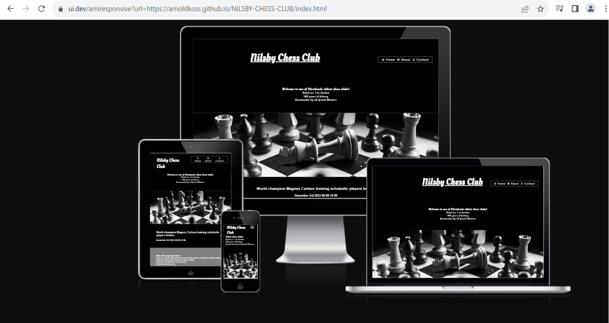

# NILSBY CHESS CLUB

Nilsby Chess Club is a page dedicated to all chess enthusiasts who want to develop their chess skills, strategies, and socialize in one place, located in Värmland, Sweden. The site caters to both experienced chess players and those looking to start their chess journey, providing resources to enhance their game and fostering a sense of community. The website offers information about our club's location, the benefits of improving chess skills, introduces the founder, and provides an opportunity for anyone to apply.

## FEATURES

- Navigation Bar  
  - This section will allow the user to easily navigate from page to page across all devices without having to revert back to the previous page via the ‘back’ button.
  - Featured on all three pages, the full responsive navigation bar includes links to the Logo, Home page, About and Contact page and is identical in each page to allow for easy navigation.
  

# Nilsby Chess Club

__The landing page image__

- The landing includes a small description of the site and photo with a chess board to grab the viewers attention
- This section also describes some reasons for the benefits that chess comes, and an upcoming event

[]