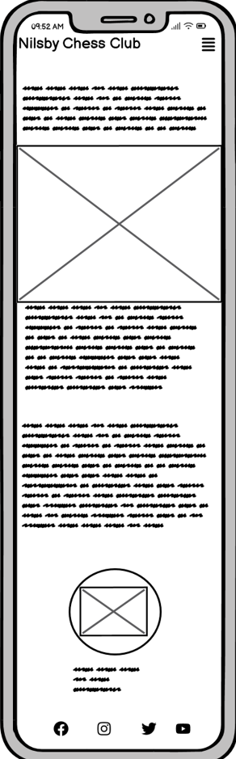
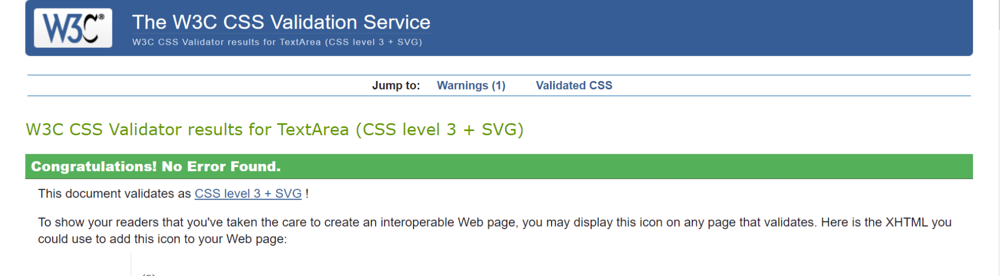

# NILSBY CHESS CLUB

Nilsby Chess Club is a page dedicated to all chess enthusiasts who want to develop their chess skills, strategies, and socialize in one place, located in Värmland, Sweden. The site caters to both experienced chess players and those looking to start their chess journey, providing resources to enhance their game and fostering a sense of community. The website offers information about our club's location, the benefits of improving chess skills, introduces the founder, and provides an opportunity for anyone to apply.

## Contents

- [NILSBY CHESS CLUB](#nilsby-chess-club)
- [Contents](#contents)
- [User Stories](#user-stories)        
- [Design](#design)
    - [Colour Scheme](#colour-scheme)
    - [Typography](#typography)
    - [Wireframes](#wireframes)
- [FEATURES](#features)
    - [Navigation Bar](#navigation-bar)
  - [Footer with social media icons](#footer-with-social-media-icons)
  - [The Contact Form](#the-contact-form)
- [Nilsby Chess Club](#nilsby-chess-club-1)
  - [Features Left to Implement](#features-left-to-implement)
  - [Testing](#testing)
- [Validator Testing](#validator-testing)
  - [Lighthouse](#lighthouse)
  - [Index page](#index-page)
  - [About page](#about-page)
  - [Contact page](#contact-page)
  - [Full testing](#full-testing)
    - [Devices](#devices)
    - [Browsers](#browsers)
    - [Manual Testing](#manual-testing)
  - [Deployment](#deployment)
  - [Credits](#credits)
    - [Code used](#code-used)
    - [Content](#content)
    - [Media](#media)

## User Stories

  - "I am a retired person living in Nilsby looking for some activities to do" 
  
   My site provides a user friendly and welcoming way to give information to new members.

- "I am an avid chess player who is looking for a challenge"

My site has interesting historical information that chess players may be interested

- "I am a social person that loves mind sports"

My site provides information about both the game and thefriendly social enviroment that most people want to have in a club.

  ## Design

  ### Colour Scheme

The choice of my color scheme was based on the colours of the chess board. To give a total feel of the game I considered these colours are best apropriate. As for the lightgrey, I implemented it for the variety, and a better feel for the user.

### Typography

I went for a Google 'Oleo Script' in the title and main text because it gave a feeling of old, as the game that the users love. As for the rest of the page i went for the standard 'Sans Serif' because i think it is easyer for the user to read and also not to give the feeling that the page is too charget.

### Wireframes
### Home

### About

### Contact

## FEATURES

- ### Navigation Bar 
  - This section will allow the user to easily navigate from page to page across all devices without having to revert back to the previous page via the ‘back’ button.
  - Featured on all three pages, the full responsive navigation bar includes links to the Logo, Home page, About and Contact page and is identical in each page to allow for easy navigation.

- ### Footer with social media icons
  
  I added four social media icons for Facebook, Instagram, Twitter and Youtube. They were sourced from font awesome.

- ### The Contact Form

I added a contact form so the user can send hes details and a message.

# Nilsby Chess Club

- ### The landing page image

  - The landing includes a small description of the site and photo with a chess board to grab the viewers attention
  - This section also contains information about an uncoming event

- ### The reasons section

  - The reasons section will allow the user to see the benefits of joining the club and playing chess.
  - The user will understand that there are daily benefits, as this sport improves the memory benefiting in the daily life 

- ### The Footer
  - The footer includes the adress, E-mail and telephone of Nilsby Chess Club
  - The footer section includes links to the relevant social media sites for Nilsby Chess Club. The links will open to a new tab to allow easy navigation for the user.
  - The footer is valuable to the user as it encourages them to keep connected via social media

- ### About Page
  - The About Page will give the user information about the location of the club, the founder of the club and the bounds that are made between the members of the club.
  - The About Page provides also pictures of the location, founder and of a feew of the members that are participating at the clubs activityes.

  

  

  

- ### The Contact Page
    - This page will allow the user to get signed up to Nilsby Chess Club and be able to become a member.
  - The user will be able to send a message in case he has additional information to request or to provide.
  - The user will be asked to submit their full name and email address as well to fill the message area.

## Features Left to Implement

- I wish to create a Gallery page and a Chess Strategy page.

## Testing

# Validator Testing

- HTML
  - I used the W3C validator, no errors were found

- CSS
  - No errors were found when passing through the official (Jigsaw) validator

## Lighthouse

I used Chrome's Lighthouse developer tool to check my sites performance, it was being slowed down by large images before compression but then faired well after compression. Below are the final results
  ## Index page

  ## About page

  ## Contact page

## Full testing 

### Devices

 I performed the full testing on the following devices:

- Laptop
   - Lenovo ThinkPad T480
- Mobile devices:
    - Samsung A52
    - Huawei Pro 50
  
### Browsers

  I used for testing the following browsers:
- Google Chrome
- Mozilla Firefox
- Microsoft Edge

Additional testing was taken by friends and familly on a variety of devices and screen sizes.

### Manual Testing

| Feature                        | Expected Outcome                                      | Testing Performed            | Result                                | Pass/Fail |
|--------------------------------|------------------------------------------------------|------------------------------|---------------------------------------|-----------|
| **Navbar**                     |                                                      |                              |                                       |           |
| Home   | When clicked, the user will be redirected to the home page. | Clicked Home  | Redirected to the home page.          | Pass      |
| About Page Link                 | When clicked, the user will be redirected to the About page. | Clicked link            | Redirected to the About page.          | Pass      |
| Contact Link             | When clicked, the user will be redirected to the Contact page. | Clicked link     | Redirected to the Contact page.  | Pass      |
| **Footer**           |                                                                     |                            |                                                      |           |
| Social Icons         | When clicked, the user will be redirected to the appropriate social media pages in a new window. | Clicked icon | Redirected to the social media page in a new window. | Pass      |
**Contact form**           |                                                                     |                            |                                                      |           |
| Contact form         | When items were left out, there was a message asking to fill the section in. | Clicked submit while leaving the form unfilled | Form requested sections to be filled in.       | Pass      |

## Deployment

The live link can be found here - <https://arnoldkoss.github.io/NILSBY-CHESS-CLUB/>

- The site was deployed to GitHub pages. The steps to deploy are as follows:
  - In the GitHub repository, navigate to the Settings tab
  - From the source section drop-down menu, select the Master Branch
  - Once the master branch has been selected, the page will be automatically refreshed with a detailed ribbon display to indicate the successful deployment.

## Credits

### Code used
I used the Love Running code for the navbar and header, but not to full extent, I have taylored it to fit on my view of how the chess club site should look like.

### Content

- The icons in the footer and the Contact page were taken from [Font Awesome](https://fontawesome.com/)
- I wrote all of the content for the website

### Media 

- The photos used on the home and About page are from [Pexels](https://www.pexels.com/)

